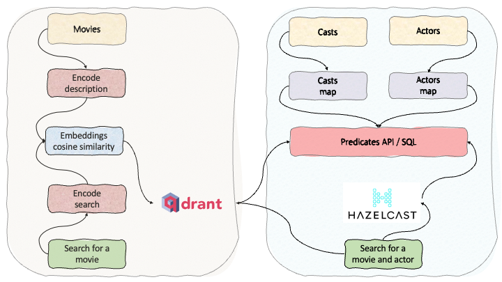

# hazelcast-qdrant
A hybrid approach of combining vector databases (Qdrant) with real-time stream processing (Hazelcast). 

# Boosting Similarity Search with Hazelcast and Qdrant - Part 1

The goal of similarity search and vector databases is to find similar results to the search query for unstructured data, such as text, images and videos. The unstructured data first is vectorised, and stored in a vector format. There are publically available tools to create vectors from unstructured data, similarly, there are vector databases to store and perform similarity searches. This is important because of the rising popularity of Large Language Models (LLMs) and their combination with vector databases.

Here we present a hybrid approach by taking the strengths of vector databases and boosting it with traditional search and filtering techniques based on real-time stream processing. Vector databases are good for building high-performance vector search applications. On the other hand, Hazelcast can be used for real-time stream processing and fast data storage for structured data (filters, tags and contextual data). Some vector databases offer filtering on structural data, which can be used or replaced with Hazelcast. In either case, Hazelcast can be used to enrich your query results, from additional resources.

<b>Hazelcast</b> is a real-time stream processing distributed computation and storage platform for consistently low-latency querying, aggregation and stateful computation against event streams and traditional data sources. It allows you to quickly build resource-efficient, real-time applications. You can deploy it at any scale from small edge devices to a large cluster of cloud instances. Don’t hesitate to share your experience with us in on <a href="https://slack.hazelcast.com/">Slack</a> or <a href="https://github.com/hazelcast">Github</a> repository. 

<b>Qdrant</b> is a vector similarity search engine and vector database. It provides a production-ready service with a convenient API to store, search, and manage points—vectors with an additional payload Qdrant is tailored to extended filtering support. It makes it useful for all sorts of neural network or semantic-based matching, faceted search, and other applications. You can try it out on <a href="https://github.com/qdrant/qdrant">Github</a> repository. 

<b>Note:</b> Both Hazelcast and Qdrant offer cloud solutions allowing to run this demo on the cloud with minimal setup and free accounts. Give it a try and let me know how you’re getting on <a href="https://www.linkedin.com/in/fawazghali/">@fawazghali</a>.

Up to here, we used Qdrant for similarity search and filtered results with predefined attributes defined in the payload. If we want to boost this similarity search with features that do not belong to vectors or payload, we can use Hazelcast features for real-time stream processing and fast data store.  

For example, we use Qdrant for similarity search on the movies dataset by encoding the description and applying filtering on the movies' voting count. The relationship between movies and actors is many-to-many. In this demo, actors are stored in a different array and linked to movies using another array, casts.

<B>Movies:</B> {id, title, description, vote_count} 
<B>Casts:</B> { movie_id, actor_id} 
<B>Actors:</B> { id, name, popularity}

Movies are stored and searched using Qdrant
Casts and actors are stored and searched using Hazelcast
Boosting = Hazelcast + Qdrant

Example:
<b>Case 1:</b> Have you ever forgotten the name of a movie but vaguely remember the story (“ramen noodles”)? In this case, we use Qdrant.
<b>Case 2:</b> Have you ever forgotten the name of a movie but vaguely remember the story (“ramen noodles”) but you remember an actor has an “an” in their names? In this case, we use Qdrant and Hazelcast.

<b>Summary:</b>
So here you have it, boosting similarity search with Hazelcast and Qdrant. Combining the strengths and advantages of vector databases and real-time stream processing provides a unique developer experience and an efficient way of processing data in real-time at scale. If you find this content useful, give it a try and let me know how you’re getting on <a href="https://www.linkedin.com/in/fawazghali/">@fawazghali</a>. Stay tuned for Part 2 where I’ll cover how you can ingest, enrich, predict and act on your data in a simplified but efficient approach.
